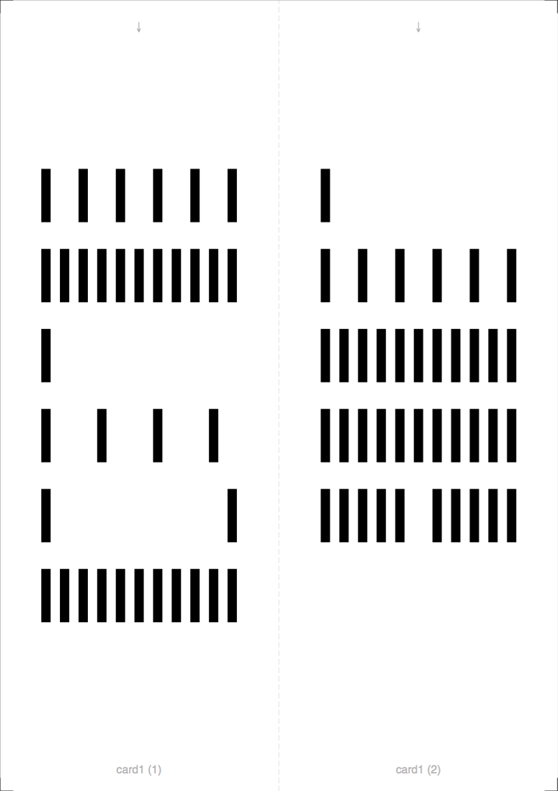

= Bar Code Card Generator

Public version of the Bar Code Card Generator. Converts binary sequences into bar code-like, printable PDF files. Intended to be used with the Linear Hamming Code Generator (7HAL32/LHC_generator).

This tool is used to create the bar code cards that contain instructions for the stack machine robot which is designed, assembled and programmed by students during the https://tu-dresden.de/ing/informatik/sya/se/studium/labs-seminars/robolab_nes[NES RoboLab] course at Technische Universität Dresden. Specifications and further information can be found at http://robolab.inf.tu-dresden.de (reachable from within campus network).

Contributors:: Frank Busse and Lutz Thies.

== Prerequisites

=== All platforms

* python3
* pip3

=== Dependencies

* reportlab

== Setup and Usage

Install https://bitbucket.org/rptlab/reportlab[reportlab] and run

```
$ ./bcgen.py card1.txt
[enjoy your card1.pdf file]
```

Remember to adjust your printer settings, for instance use "Scale: 100%" in macOS, to suppress scaling.


